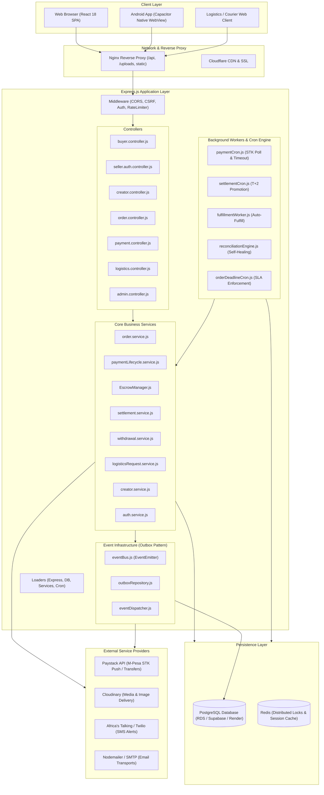
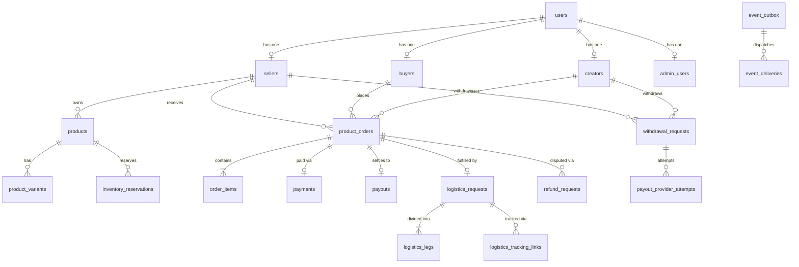
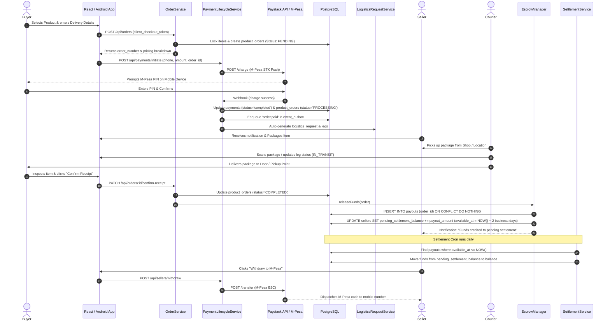
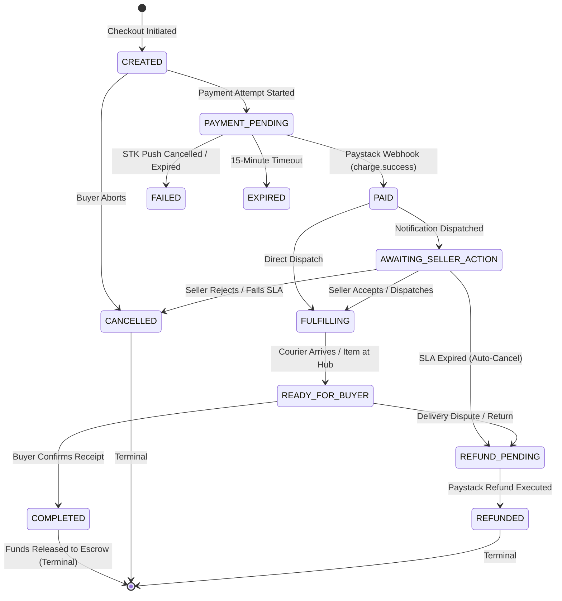
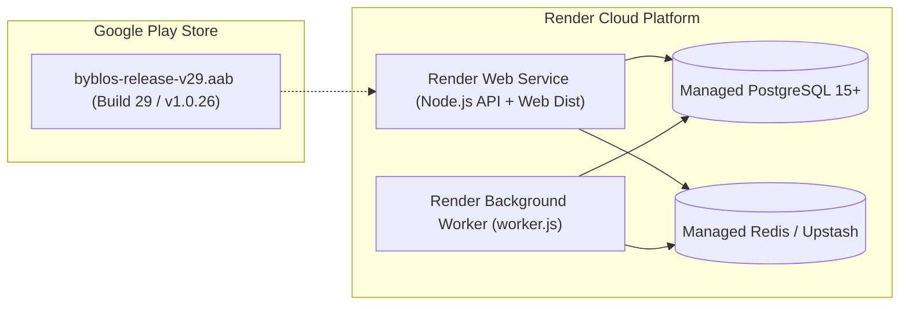

# Byblos — Complete Codebase Reverse-Engineering Architecture Report

> **Target Audience**: Senior Staff Engineers, Systems Architects, and Technical Investigators.  
> **Repository Under Analysis**: `bybloshq` (Full-Stack Monorepo).  
> **Source of Truth**: Active codebase implementation, database migrations, and runtime configuration.  
> **Report Status**: Comprehensive Engineering Architecture & Reverse-Engineering Audit.

---

# 1. Executive Summary

### 1.1 Technical Definition
**Byblos** is an escrow-backed social commerce and logistics platform engineered specifically for the East African market (primarily Nairobi, Kenya). Technically, it is a multi-role distributed commerce system comprising a React/Vite single-page application (cross-compiled to native Android via Capacitor) and a Node.js/Express backend backed by PostgreSQL, Redis, and Paystack (M-Pesa STK Push / Card / Mobile Money).

### 1.2 Actors & Roles
The system unifies five distinct user roles over a single identity database layer:
1. **Buyers**: Discover shops, book services, order physical/digital goods, pay via M-Pesa STK Push or Paystack Checkout, track deliveries in real time, and confirm delivery to release funds.
2. **Sellers**: Operate branded digital storefronts, manage product catalogs (physical, digital download, service booking, custom production SLA, imported pre-orders), fulfill orders, request dispatch via logistics, and withdraw settled earnings to M-Pesa.
3. **Creators (Affiliates)**: Curate public recommendation boards, generate trackable referral links, and earn automated commission splits on driven sales.
4. **Logistics Operators (Mzigo / Hub Staff)**: Manage multi-leg fulfillment (Seller Pickup $\rightarrow$ Central Sorting Hub $\rightarrow$ Buyer Delivery), update tracking waypoints, record recipient verification codes, and log live coordinates.
5. **Administrators & Marketing**: Platform governance, dispute arbitration, financial metrics audit, seller verification, manual refund triggers, and fee schedule controls.

### 1.3 The Core Transaction
The core transaction solves the "social media trust deficit" in peer-to-peer commerce:
* **The Problem**: On platforms like Instagram, TikTok, and WhatsApp, buyers fear paying upfront because rogue sellers may not deliver, while sellers fear cash-on-delivery due to fake orders and delivery rider transit risks.
* **The Byblos Mechanism**: When a buyer orders from a seller's storefront, money is collected immediately via M-Pesa into Byblos's custodial Paystack account. The platform places the order into an **escrow state** (`PAID` / `PROCESSING`). The seller only receives payout credit in their pending wallet once the buyer confirms delivery (or when automated SLA deadlines expire without dispute). If the seller fails to fulfill within guaranteed SLA windows, the system automatically cancels the order and initiates a full buyer refund.

### 1.4 Architectural Distinctiveness
1. **Settlement-Aware Financial Ledger**: Seller wallet balances distinguish between `pending_settlement_balance` (held during Paystack's T+2 business day clearing cycle) and `balance` (withdrawable).
2. **Transactional Outbox Event Bus**: Event dispatching utilizes an in-database `event_outbox` table locked in the same PostgreSQL transaction as state mutations to prevent dual-write inconsistencies.
3. **Multi-Leg Logistics State Machine**: Logistics handles both direct door-to-door delivery and 2-leg hub routing (Seller $\rightarrow$ Hub, Hub $\rightarrow$ Buyer).
4. **Unified Identity with Isolated Role Contexts**: A single row in `users` maps to role-specific profile tables (`buyers`, `sellers`, `creators`, `admin_users`), allowing single-credential multi-portal usage.

---

# 2. System Architecture



---

# 3. Repository Structure

```
bybloshq/
├── android/                             # Native Android Studio Project (Capacitor wrapper)
│   ├── app/build.gradle                 # Android package ID, versionCode (29), SDK targets
│   └── src/main/                        # Android Manifest, Java bridge, assets
├── capacitor.config.ts                  # Capacitor configuration (scheme: https, appId: space.bybloshq.app)
├── server/                              # Backend Node.js / Express Application
│   ├── email-templates/                 # EJS email templates (reset password, order confirm, verification)
│   ├── migrations/                      # 46 SQL migrations defining database evolution
│   └── src/
│       ├── config/                      # Environment schema validation & fee constants
│       ├── controllers/                 # HTTP request handlers & response formatting
│       ├── cron/                        # Scheduled cron workers (settlement, deadlines, cleanup)
│       ├── events/                      # Transactional outbox event listeners & dispatcher
│       ├── loaders/                     # Application bootstrap sequence (DB, Express, Cron, Indexes)
│       ├── middleware/                  # Auth guards, CSRF double-submit, rate limiters, upload hooks
│       ├── models/                      # Database query abstraction models (pg pool drivers)
│       ├── policies/                    # Fine-grained authorization rules (OrderPolicy, ProductPolicy)
│       ├── providers/                   # External API client adapters (PaystackProviderClient)
│       ├── repositories/                # Domain-specific SQL data access objects
│       ├── routes/                      # Express route definitions grouped by domain
│       ├── services/                    # Core business logic orchestrators
│       ├── shared/                      # Database pool, logging (Winston), AppError, Enums
│       ├── index.js                     # Main application entrypoint (HTTP server + cron)
│       └── worker.js                    # Standalone background worker process entrypoint
├── src/                                 # Frontend React 18 Application (Vite + TypeScript)
│   ├── api/                             # Axios client instances & role-based endpoint bindings
│   ├── components/                      # Reusable UI widgets, modals, checkout dialogs, forms
│   ├── features/                        # Domain-driven feature slices (auth, shop, membership, notifications)
│   ├── hooks/                           # Custom React hooks (React Query mutations, cart, auth)
│   ├── lib/                             # Global apiClient, authStateManager, storage adapters
│   ├── routes/                          # React Router v6 route matrices (buyer, seller, admin)
│   ├── stores/                          # Zustand global client-side state stores
│   ├── types/                           # TypeScript interface definitions
│   ├── App.tsx                          # App root with QueryClientProvider & Toaster
│   └── main.tsx                         # DOM mount point
├── vite.config.ts                       # Vite bundler configuration & asset splitting chunks
└── package.json                         # Monorepo dependencies and build scripts
```

---

# 4. Frontend Architecture

### 4.1 Technology Stack & Build Pipeline
* **Framework**: React 18.3 with TypeScript.
* **Build System**: Vite 5.4 with chunk splitting (`react-vendor`, `ui-vendor`, `charts-vendor`, `utils-vendor`).
* **Styling**: TailwindCSS with CSS custom properties and Radix UI primitives (`@radix-ui/*`).
* **Routing**: `react-router-dom` v6 with lazy-loaded route chunks.
* **Server State**: `@tanstack/react-query` v5 for caching, background revalidation, and mutation states.
* **Client State**: `zustand` stores for localized client state (e.g. cart drawer, active filters).
* **Native Mobile Bridge**: `@capacitor/core`, `@capacitor/preferences`, `@capacitor/push-notifications`.

### 4.2 Application Bootstrap Sequence
```text
src/main.tsx
 └── Mount to #root
      └── src/App.tsx
           ├── QueryClientProvider (React Query Client with retry: 1, staleTime: 30s)
           ├── AuthProvider (features/auth/context/AuthContext.tsx)
           │    ├── authStateManager.init() (Loads active session from storage)
           │    └── useAuthRevalidation() (Verifies active token against /me endpoint)
           ├── RouterProvider (src/routes/index.tsx)
           └── Toaster (Sonner & Shadcn UI toast portals)
```

### 4.3 Routing & Role Protection Architecture
Frontend routes are segmented into dedicated route arrays:
1. **Public Routes** ([`src/routes/index.tsx`](file:///c:/Users/Administrator/Downloads/evolve/evolve%20projects/byblos/code/bybloshq/src/routes/index.tsx)): Home (`/`), Shopfronts (`/:shopSlug` or `/shop/:shopSlug`), Product details, Public Order Tracking (`/track/:trackingNumber`), Terms, Privacy.
2. **Buyer Portal** ([`src/routes/buyer.routes.tsx`](file:///c:/Users/Administrator/Downloads/evolve/evolve%20projects/byblos/code/bybloshq/src/routes/buyer.routes.tsx)): `/buyer/dashboard`, `/buyer/orders`, `/buyer/wishlist`, `/buyer/profile`, guarded by `<ProtectedRoute requiredRole="buyer">`.
3. **Seller Portal** ([`src/routes/seller.routes.tsx`](file:///c:/Users/Administrator/Downloads/evolve/evolve%20projects/byblos/code/bybloshq/src/routes/seller.routes.tsx)): `/seller/dashboard/*` (Overview, Products, Orders, Logistics, Wallet/Withdrawals, Settings, Creator links), guarded by `<ProtectedRoute requiredRole="seller">`.
4. **Creator Portal** ([`src/routes/index.tsx`](file:///c:/Users/Administrator/Downloads/evolve/evolve%20projects/byblos/code/bybloshq/src/routes/index.tsx)): `/creator/dashboard/*`, `/creator/links`, `/creator/earnings`, guarded by `<ProtectedRoute requiredRole="creator">`.
5. **Logistics & Admin Portals** ([`src/routes/admin.routes.tsx`](file:///c:/Users/Administrator/Downloads/evolve/evolve%20projects/byblos/code/bybloshq/src/routes/admin.routes.tsx)): `/admin/dashboard`, `/logistics/dashboard`, `/mzigo/dashboard`.

### 4.4 Frontend API Client & Request Pipeline
*File: [`src/lib/apiClient.ts`](file:///c:/Users/Administrator/Downloads/evolve/evolve%20projects/byblos/code/bybloshq/src/lib/apiClient.ts)*
* **Base URL Resolution** ([`src/lib/apiBaseUrl.ts`](file:///c:/Users/Administrator/Downloads/evolve/evolve%20projects/byblos/code/bybloshq/src/lib/apiBaseUrl.ts)):
  * Web browser: Uses relative path `/api` (relies on reverse proxy / Vite proxy).
  * Android Native: Connects directly to `https://www.byblosafrica.site/api`.
* **Request Interceptor**:
  1. Inspects destination URL segment (`/sellers`, `/buyers`, `/creators`, `/admin`, `/logistics`).
  2. Extracts corresponding JWT from `@capacitor/preferences` storage (`sellerToken`, `buyerToken`, etc.).
  3. Attaches header: `Authorization: Bearer <token>`.
  4. Manages Double Submit CSRF token cache with 10-minute TTL for mutation verbs (`POST`, `PUT`, `PATCH`, `DELETE`).
* **Response Interceptor**:
  1. On `401 Unauthorized`: Calls `tryRefreshAndRetry()` using stored rolling refresh token. If refresh fails, clears session markers and routes to login via `emitSessionExpired()`.
  2. On `403 Forbidden (CSRF Mismatch)`: Automatically fetches a fresh token via `/public/csrf-token` and retries the mutation once.
  3. On `429 Too Many Requests` / `500 Server Error`: Fires Sonner toast alerts with descriptive feedback.

---

# 5. Backend Architecture

### 5.1 Architectural Classification
The backend adheres to a **Layered Architecture with Service/Repository separation and Event-Driven Outbox Persistence**:
* **Controller Layer** (`server/src/controllers/`): HTTP protocol translation, request input extraction, validation invocation, HTTP status response formatting.
* **Policy Layer** (`server/src/policies/`): Pure authorization rules asserting resource ownership (e.g. `OrderPolicy.canSellerManageOrder(sellerId, order)`).
* **Service Layer** (`server/src/services/`): Pure transactional business logic, state machines, fee calculations, escrow transitions.
* **Repository Layer** (`server/src/repositories/`): Raw SQL data-access queries using parameterized PostgreSQL driver (`pg`).
* **Event Outbox Layer** (`server/src/events/`): Transactionally safe asynchronous domain event propagation.

### 5.2 Server Startup Sequence
*File: [`server/src/index.js`](file:///c:/Users/Administrator/Downloads/evolve/evolve%20projects/byblos/code/bybloshq/server/src/index.js)*
```text
1. validateEnvironment() -> Validates DB credentials, Paystack keys, JWT secrets, Redis URL.
2. Event Listeners Boot -> Loads order.events.js, payment.events.js, logistics.events.js into EventBus.
3. Database Loader -> Initializes PostgreSQL Connection Pool (pg.Pool).
4. Schema Check Loader -> Verifies critical runtime indexes and columns exist in DB.
5. Express Middleware Loader -> Configures CORS, Helmet CSP, JSON body parser (with rawBody capture), CookieParser, CSRF double-submit check.
6. Route Mounting -> Mounts domain routers under /api.
7. Background Workers & Cron -> Boots PaymentCron, SettlementCron, ReconciliationEngine, FulfillmentWorker, OrderDeadlineCron.
8. HTTP Server Listen -> Binds to process.env.PORT (default: 3002).
```

### 5.3 Core Backend Endpoints Mapping

| Domain | Method | Route | Controller Handler | Main Service |
| :--- | :--- | :--- | :--- | :--- |
| **Auth** | `POST` | `/api/buyers/login` | `buyerController.login` | `AuthService.login` |
| **Auth** | `POST` | `/api/sellers/login` | `sellerAuthController.login` | `AuthService.login` |
| **Auth** | `POST` | `/api/creators/login` | `creatorController.login` | `CreatorService.login` |
| **Orders** | `POST` | `/api/orders` | `orderController.createOrder` | `OrderService.createOrder` |
| **Orders** | `GET` | `/api/orders/:id` | `orderController.getOrder` | `OrderReadService.getOrderById` |
| **Orders** | `PATCH`| `/api/orders/:id/confirm-receipt` | `buyerController.confirmOrderReceipt` | `OrderService.confirmReceipt` |
| **Payment**| `POST` | `/api/payments/initiate` | `paymentController.initiatePayment` | `PaymentLifecycleService.initiatePayment` |
| **Payment**| `POST` | `/api/payments/webhook` | `paymentController.handleWebhook` | `PaymentLifecycleService.handleProviderCallback` |
| **Escrow** | `POST` | `/api/orders/:id/complete`| `orderController.completeOrder` | `EscrowManager.releaseFunds` |
| **Wallet** | `POST` | `/api/sellers/withdraw` | `sellerController.requestWithdrawal`| `WithdrawalService.requestWithdrawal` |
| **Logistics**| `POST`| `/api/logistics/request` | `logisticsController.createRequest` | `LogisticsRequestService.createLogisticsRequest`|
| **Logistics**| `PATCH`| `/api/logistics/legs/:id/status`| `logisticsController.updateLegStatus`| `LogisticsRequestService.updateLegStatus` |

---

# 6. Database Architecture

### 6.1 Entity-Relationship Diagram



### 6.2 Key Table Specifications & Financial Data Model

#### 1. `users` (Identity Root)
* Primary Key: `id UUID DEFAULT gen_random_uuid()`
* Fields: `email VARCHAR(255) UNIQUE`, `password_hash VARCHAR(255)`, `role VARCHAR(50)`, `is_verified BOOLEAN`, `reset_password_token VARCHAR(255)`, `reset_password_expires TIMESTAMPTZ`, `created_at TIMESTAMPTZ`.

#### 2. `sellers` (Merchant Profile & Wallet Ledger)
* Primary Key: `id UUID DEFAULT gen_random_uuid()`
* Foreign Key: `user_id UUID REFERENCES users(id)`
* Financial Ledger Columns:
  * `balance NUMERIC(12, 2) DEFAULT 0.00`: **Withdrawable Balance** (funds that have passed the Paystack clearing window).
  * `pending_settlement_balance NUMERIC(12, 2) DEFAULT 0.00`: **Unsettled Balance** (funds released from escrow on order completion, pending T+2 clearing).
  * `total_sales NUMERIC(12, 2) DEFAULT 0.00`: Gross lifetime sales volume.
  * `net_revenue NUMERIC(12, 2) DEFAULT 0.00`: Net earnings after platform fees.
* Business Columns: `shop_name`, `slug UNIQUE`, `city`, `location`, `physical_address`, `latitude`, `longitude`, `terms_accepted`, `is_active`.

#### 3. `product_orders` (Order Master Table)
* Primary Key: `id UUID DEFAULT gen_random_uuid()`
* Fields: `order_number VARCHAR(100) UNIQUE`, `seller_id UUID REFERENCES sellers(id)`, `buyer_id UUID REFERENCES buyers(id)`, `creator_id UUID REFERENCES creators(id)`, `status VARCHAR(50)`, `payment_status VARCHAR(50)`, `fulfillment_status VARCHAR(50)`, `total_amount NUMERIC(12,2)`, `seller_payout_amount NUMERIC(12,2)`, `platform_fee_amount NUMERIC(12,2)`, `client_checkout_token VARCHAR(160) UNIQUE`, `sla_deadline TIMESTAMPTZ`, `metadata JSONB`.

#### 4. `payments` (Transaction Gateway Records)
* Primary Key: `id UUID DEFAULT gen_random_uuid()`
* Fields: `order_id UUID`, `invoice_id VARCHAR(100)`, `reference VARCHAR(100) UNIQUE`, `provider VARCHAR(50) DEFAULT 'paystack'`, `amount NUMERIC(12,2)`, `status VARCHAR(50)` (`pending`, `completed`, `failed`, `refunded`), `payment_method VARCHAR(50)`, `channel VARCHAR(50)`, `metadata JSONB`.

#### 5. `payouts` (Escrow Release Ledger)
* Primary Key: `id UUID DEFAULT gen_random_uuid()`
* Unique Constraint: `UNIQUE(order_id)` — **The Primary Idempotency Gate for Escrow Release**.
* Fields: `seller_id UUID`, `order_id UUID`, `payment_id UUID`, `amount NUMERIC(12,2)`, `platform_fee NUMERIC(12,2)`, `status VARCHAR(50)`, `settlement_status VARCHAR(50)` (`pending_settlement`, `settled`, `settlement_review`), `available_at TIMESTAMPTZ`.

#### 6. `withdrawal_requests` (Seller / Creator Cash-Out)
* Primary Key: `id UUID DEFAULT gen_random_uuid()`
* Fields: `seller_id UUID`, `creator_id UUID`, `buyer_id UUID`, `amount NUMERIC(12,2)`, `status VARCHAR(50)` (`pending`, `processing`, `completed`, `failed`, `rejected`), `mpesa_number VARCHAR(50)`, `metadata JSONB`.

#### 7. `event_outbox` (Transactional Outbox Pattern)
* Primary Key: `id UUID DEFAULT gen_random_uuid()`
* Fields: `event_name VARCHAR(100)`, `event_id VARCHAR(160) UNIQUE`, `aggregate_type VARCHAR(50)`, `aggregate_id VARCHAR(100)`, `payload JSONB`, `status VARCHAR(50)` (`pending`, `processing`, `delivered`, `failed`), `attempts INT DEFAULT 0`, `created_at TIMESTAMPTZ`.

---

# 7. The Core Byblos Transaction (End-to-End Trace)



---

# 8. Order State Machine

*File: [`server/src/shared/utils/OrderStatusGuard.js`](file:///c:/Users/Administrator/Downloads/evolve/evolve%20projects/byblos/code/bybloshq/server/src/shared/utils/OrderStatusGuard.js)*



### State Definitions and Transition Logic
1. **`CREATED` / `PAYMENT_PENDING`**: Initial state while waiting for STK Push entry. Guarded by 15-minute expiration worker (`paymentCron.js`).
2. **`PAID` / `PROCESSING`**: Webhook has validated signature and confirmed payment in full. Inventory reservation is hard-committed.
3. **`AWAITING_SELLER_ACTION` / `FULFILLING`**: Seller has acknowledged order. Custom production / import SLA timer begins countdown.
4. **`READY_FOR_BUYER` / `DELIVERED`**: Courier has logged drop-off or physical pickup is ready.
5. **`COMPLETED`**: Buyer explicitly clicks "Confirm Receipt" OR 72-hour silent inspection period passes without dispute. **Triggers Escrow Release**.
6. **`REFUND_PENDING` / `REFUNDED`**: Order cancelled before dispatch or dispute resolved in buyer's favor.

---

# 9. Payment Architecture

### 9.1 Supported Providers & Flow
* **Primary Provider**: **Paystack** ([`server/src/providers/PaystackProviderClient.js`](file:///c:/Users/Administrator/Downloads/evolve/evolve%20projects/byblos/code/bybloshq/server/src/providers/PaystackProviderClient.js)).
* **Payment Channels**:
  1. **M-Pesa STK Push**: Initiated directly from backend to user's phone via `PaystackProviderClient.chargeMpesa({ phone, amount, reference })`.
  2. **Card / Alternative Channels**: Standard Paystack Hosted Checkout URL.

### 9.2 Webhook Security & Idempotency
*File: [`server/src/middleware/paystackWebhookSecurity.js`](file:///c:/Users/Administrator/Downloads/evolve/evolve%20projects/byblos/code/bybloshq/server/src/middleware/paystackWebhookSecurity.js)*
1. **HMAC Signature Verification**:
   * Computes `crypto.createHmac('sha512', secret).update(req.rawBody).digest('hex')`.
   * Compares with header `x-paystack-signature` using `crypto.timingSafeEqual` to prevent timing attacks.
2. **Database Concurrency Lock**:
   * Uses `SELECT * FROM payments WHERE reference = $1 FOR UPDATE` within an isolated PostgreSQL transaction to prevent race conditions from duplicate webhook deliveries.
3. **Event Deduplication**:
   * Records webhook event ID in `processed_webhook_events` table before executing state changes.

---

# 10. Escrow & Trust Model

### 10.1 Escrow Reality: Custodial Account vs. Ledger State
* **Fact**: Byblos does **not** run an isolated cryptographic smart contract or third-party custodial banking escrow account for each transaction.
* **Implementation**: All incoming funds pool directly into Byblos's master Paystack merchant account. **Escrow is enforced as a strict state machine ledger within the Byblos PostgreSQL database**.
* **Financial Safety Guarantees**:
  1. Funds cannot be withdrawn by a seller while an order is in `PROCESSING`, `FULFILLING`, or `IN_TRANSIT`.
  2. Seller balance rows in `sellers` table have database check constraints (`balance >= 0`, `pending_settlement_balance >= 0`).
  3. Releasing funds requires `order.status === 'COMPLETED'` verified by [`EscrowManager.js:18`](file:///c:/Users/Administrator/Downloads/evolve/evolve%20projects/byblos/code/bybloshq/server/src/services/EscrowManager.js#L18).
  4. Payout creation uses an atomic `INSERT INTO payouts ... ON CONFLICT (order_id) DO NOTHING` gate.

---

# 11. Seller Payouts & Settlement Model

### 11.1 The Settlement Clearing Cycle (T+2 Business Days)
Paystack settles processed M-Pesa collections into Byblos's corporate bank account on a **T+2 business day schedule** (excluding Saturdays and Sundays).
* **The Settlement Risk**: If Byblos allowed sellers to withdraw funds immediately upon order completion, Byblos would be floating uncollected capital from its own reserves.
* **The Solution** ([`server/src/services/settlement.service.js`](file:///c:/Users/Administrator/Downloads/evolve/evolve%20projects/byblos/code/bybloshq/server/src/services/settlement.service.js)):
  1. On order completion, `EscrowManager` calculates `available_at = addBusinessDays(NOW(), 2)`.
  2. Funds are credited to `sellers.pending_settlement_balance`.
  3. Daily cron job (`settlementCron.js`) queries `payouts WHERE settlement_status = 'pending_settlement' AND available_at <= NOW() FOR UPDATE SKIP LOCKED`.
  4. Automatically decrements `pending_settlement_balance` and increments `balance` (withdrawable).

### 11.2 Withdrawal Pipeline (B2C M-Pesa Transfer)
*File: [`server/src/services/withdrawal.service.js`](file:///c:/Users/Administrator/Downloads/evolve/evolve%20projects/byblos/code/bybloshq/server/src/services/withdrawal.service.js)*
1. **Validation & Balance Reservation**:
   Locks seller row `FOR UPDATE`, validates `balance >= amount + withdrawalFee`, decrements `balance`, and moves funds into a reserved state.
2. **Provider Dispatch**:
   Creates `payout_provider_attempts` row (`status: 'provider_call_started'`) and invokes Paystack Transfer API.
3. **Asynchronous Resolution**:
   Paystack sends `transfer.success` or `transfer.failed` webhook $\rightarrow$ `PayoutCallbackStateMachineService` finalizes the withdrawal or refunds the reserved balance back to the seller.

---

# 12. Logistics & Delivery System

### 12.1 Delivery Modes & Multi-Leg Architecture
*File: [`server/src/services/logisticsRequest.service.js`](file:///c:/Users/Administrator/Downloads/evolve/evolve%20projects/byblos/code/bybloshq/server/src/services/logisticsRequest.service.js)*
Byblos supports two delivery topologies:
1. **Direct Door Delivery (1-Leg)**: Courier picks up from seller shop and delivers directly to buyer's GPS coordinates/address.
2. **Hub-and-Spoke Delivery (2-Leg)**:
   * **Leg 1 (`pickup`)**: Seller drops off package at Central Nairobi Hub (or courier picks up and brings to Hub).
   * **Leg 2 (`delivery`)**: Hub sorts package and dispatches last-mile courier to buyer.

### 12.2 Public Tracking & Verification
* Tracking URL structure: `/track/:trackingNumber` (e.g. `BYB-TRK-10824-A9F2`).
* Public tracking links use cryptographically random tokens stored in `logistics_tracking_links`.
* Delivery confirmation requires rider verification (recipient code or recipient phone confirmation).

---

# 13. Authentication & Authorization

### 13.1 Authentication Strategy
1. **Unified Identity Model**: All credentials exist in the `users` table. Password hashes use `bcrypt` with cost factor 12.
2. **Dual Transport Strategy**:
   * **Web Browsers**: Stores primary JWT in `httpOnly`, `Secure`, `SameSite=Lax` cookies (`jwt`) to prevent XSS credential theft.
   * **Android / Mobile App**: Stores JWT in secure hardware-backed device storage (`@capacitor/preferences`) and transmits via `Authorization: Bearer <token>` header.
3. **CSRF Architecture**:
   * Implements **Double-Submit Cookie Pattern** (`csrf-token-v2` cookie matching `X-CSRF-Token` header).
   * Verified native app origins (`https://localhost`, `capacitor://localhost`) and explicit `Bearer` token requests are exempted in [`server/src/loaders/express.js:197-215`](file:///c:/Users/Administrator/Downloads/evolve/evolve%20projects/byblos/code/bybloshq/server/src/loaders/express.js#L197-L215) because native sandboxes are immune to browser ambient-credential CSRF.

### 13.2 Role & Permission Matrix

| Feature / Action | Anonymous | Buyer | Seller | Creator | Logistics | Admin |
| :--- | :---: | :---: | :---: | :---: | :---: | :---: |
| Browse Shops & Products | ✓ | ✓ | ✓ | ✓ | ✓ | ✓ |
| Place Order & Pay | ✓ (Guest) | ✓ | — | — | — | — |
| View Buyer Order History | — | ✓ | — | — | — | ✓ |
| Manage Products & Stock | — | — | ✓ (Own) | — | — | ✓ |
| Confirm Order Fulfillment | — | — | ✓ (Own) | — | — | ✓ |
| Manage Logistics & Legs | — | — | — | — | ✓ | ✓ |
| Withdraw Settled Wallet Funds | — | — | ✓ | ✓ | — | — |
| Arbitrate Disputes & Refunds | — | — | — | — | — | ✓ |
| Access Marketing Analytics | — | — | — | — | — | ✓ |

---

# 14. Events & Asynchronous Architecture

### 14.1 Transactional Outbox Pattern
*File: [`server/src/events/outboxRepository.js`](file:///c:/Users/Administrator/Downloads/evolve/evolve%20projects/byblos/code/bybloshq/server/src/events/outboxRepository.js)*
To prevent dual-write inconsistencies between database mutations and asynchronous events (SMS, emails, push notifications, webhooks), Byblos utilizes the **Transactional Outbox Pattern**:
1. Within an open database transaction (`client = await pool.connect(); await client.query('BEGIN')`), domain services call `eventBus.enqueueInTransaction(client, AppEvents.ORDER_PAID, payload)`.
2. The event is persisted directly into the `event_outbox` table.
3. Upon successful `COMMIT`, `eventBus.dispatchAfterCommit(eventId)` triggers immediate asynchronous delivery.
4. If the Node process crashes before dispatch, `FulfillmentWorker` and `ReconciliationEngine` scan `event_outbox WHERE status = 'pending'` on boot and replay pending events with exponential backoff.

### 14.2 Domain Event Map

| Event Name | Producer | Primary Consumers | Side Effects |
| :--- | :--- | :--- | :--- |
| `order.created` | `OrderService` | `order.events.js` | Emits notification payload, reserves inventory. |
| `order.paid` | `PaymentLifecycleService` | `payment.events.js` | Auto-generates logistics request, sends buyer/seller email & SMS. |
| `order.completed` | `OrderService` | `order.events.js` | Triggers `EscrowManager.releaseFunds`, credits creator affiliate split. |
| `order.cancelled` | `OrderCancellationService`| `order.events.js` | Releases inventory reservation, notifies parties. |
| `logistics.leg_updated`| `LogisticsRequestService` | `logistics.events.js` | Updates tracking link timestamp, syncs order fulfillment status. |
| `withdrawal.requested` | `WithdrawalService` | `payout.events.js` | Invokes Paystack B2C transfer client. |

---

# 15. Security Review & Threat Analysis

### 15.1 Security Evaluation Matrix

| Category | Implementation in Byblos | Status / Rating |
| :--- | :--- | :--- |
| **SQL Injection** | 100% Parameterized queries (`$1, $2`) via `pg.Pool`. Zero raw string concatenations found. | **Secure (Pass)** |
| **XSS Defense** | React automatic JSX escaping + `xss-clean` middleware + Helmet CSP headers. | **Secure (Pass)** |
| **CSRF Defense** | Double-Submit Cookie pattern with 10m TTL + Native app Bearer exemptions. | **Secure (Pass)** |
| **Brute Force** | Redis-backed `globalLimiter` (100 req/15m) + `authLimiter` (5 attempts/15m). | **Secure (Pass)** |
| **Webhook Spoofing**| Paystack HMAC SHA-512 signature validation using `crypto.timingSafeEqual`. | **Secure (Pass)** |
| **IDOR / Object Access**| `OrderPolicy` and `ProductPolicy` assert ownership (`seller_id === req.user.id`). | **Secure (Pass)** |
| **Financial Concurrency**| Database row locking (`FOR UPDATE`) on balance deductions and checkout creation. | **Secure (Pass)** |

---

# 16. Data Consistency & Concurrency Invariants

### 16.1 Critical Concurrency Scenarios & Code Behavior

1. **Two buyers purchasing the last stock item simultaneously**:
   * *Handled*: [`inventoryReservation.service.js:45-80`](file:///c:/Users/Administrator/Downloads/evolve/evolve%20projects/byblos/code/bybloshq/server/src/services/inventoryReservation.service.js#L45-L80) performs `SELECT stock_quantity FROM products WHERE id = $1 FOR UPDATE`. The second transaction blocks, detects `stock_quantity === 0`, and throws `INSUFFICIENT_STOCK` (409 Conflict).
2. **Paystack payment webhook delivered twice in rapid succession**:
   * *Handled*: [`paymentLifecycle.service.js:1420-1460`](file:///c:/Users/Administrator/Downloads/evolve/evolve%20projects/byblos/code/bybloshq/server/src/services/paymentLifecycle.service.js#L1420-L1460) acquires a row-lock on `payments WHERE reference = $1 FOR UPDATE`. The second webhook finds `status === 'completed'` and immediately returns `200 OK` (no-op).
3. **Escrow release triggered twice**:
   * *Handled*: [`EscrowManager.js:98-126`](file:///c:/Users/Administrator/Downloads/evolve/evolve%20projects/byblos/code/bybloshq/server/src/services/EscrowManager.js#L98-L126) executes `INSERT INTO payouts ... ON CONFLICT (order_id) DO NOTHING RETURNING id`. Only the winning thread receives an inserted ID; the duplicate thread aborts before modifying seller balances.
4. **Seller attempts to withdraw more than settled balance**:
   * *Handled*: [`withdrawal.service.js:120-160`](file:///c:/Users/Administrator/Downloads/evolve/evolve%20projects/byblos/code/bybloshq/server/src/services/withdrawal.service.js#L120-L160) locks `sellers WHERE id = $1 FOR UPDATE` and checks `balance >= amount + fee`. Furthermore, PostgreSQL column constraint `CHECK (balance >= 0)` guarantees database-level integrity.

---

# 17. Testing Architecture

### 17.1 Test Infrastructure
* **Test Runner**: Vitest (`vitest.config.ts`).
* **Environment**: `jsdom` for React components, Node for backend unit tests.
* **Test Suites Available**:
  * Integration tests: [`src/components/dashboard-render-cache.integration.test.tsx`](file:///c:/Users/Administrator/Downloads/evolve/evolve%20projects/byblos/code/bybloshq/src/components/dashboard-render-cache.integration.test.tsx)
  * Scratch verification scripts in `.gemini/antigravity/brain/.../scratch/` for live API contract checks.
* **Coverage Assessment**:
  * Strong: Auth validation, order state transitions, settlement date arithmetic.
  * Recommendation: Expand automated integration tests for Paystack webhook failure scenarios and concurrent checkout reservations.

---

# 18. Configuration & Deployment

### 18.1 Runtime Topology



### 18.2 Critical Environment Variables
* `DATABASE_URL`: PostgreSQL connection string with SSL.
* `REDIS_URL`: Redis cache and distributed lock instance.
* `PAYSTACK_SECRET_KEY` / `PAYSTACK_PUBLIC_KEY`: API keys for payment processing and B2C transfers.
* `JWT_SECRET` / `JWT_REFRESH_SECRET`: Secrets for signing role-scoped access and refresh tokens.
* `FRONTEND_URL`: Canonical web URL (default: `https://www.byblosafrica.site`).
* `BYBLOS_PROCESS_ROLE`: Process mode selector (`web`, `worker`, or `all`).

---

# 19. Architectural Risks & Recommendations

| Priority | Area | Risk Description | Code Location | Recommended Action |
| :--- | :--- | :--- | :--- | :--- |
| **P0** | **Database** | Database migration runner is executed via custom scripts rather than an automated migration tool (e.g. Flyway / Prisma / Knex). | `server/migrations/` | Adopt a formal migration runner with a lock table (e.g. `node-pg-migrate`) in CI/CD pipeline. |
| **P1** | **Monolithic Service** | `order.service.js` and `paymentLifecycle.service.js` exceed 1,000 lines each, coupling order creation, notifications, and logistics. | `server/src/services/` | Extract `InventoryService` and `NotificationDispatcher` into dedicated modular service classes. |
| **P2** | **Escrow Audit** | Ledger balance is stored on `sellers.balance` rather than reconstructed from an immutable double-entry journal. | `sellers` table | Introduce a double-entry ledger table (`journal_entries`, `ledger_accounts`) for audit compliance. |
| **P3** | **Observability** | Error logging outputs structured JSON to stdout/Winston but lacks distributed tracing (OpenTelemetry / Sentry). | `logger.js` | Wire Sentry or Datadog APM for live exception alerting and transaction profiling. |

---

# 20. "How Byblos Actually Works" — Senior Engineer Onboarding Guide

### 20.1 Mental Model in 60 Seconds
Think of Byblos as **Shopify + Uber Eats Logistics + Escrow Pay**:
1. Every merchant gets an optimized storefront (`byblosafrica.site/shop/:slug`) where their social media followers buy products.
2. When a buyer checks out, Byblos collects the funds via M-Pesa into a central custodial account.
3. The order enters an Escrow hold state.
4. Logistics coordinates last-mile delivery via Mzigo dispatchers.
5. Upon delivery confirmation, the escrow engine marks funds as settled, and after clearing (T+2), the merchant transfers their profit straight to their personal M-Pesa.

### 20.2 Recommended Reading Order for New Engineers
1. **Database Schema**: Read [`server/migrations/20260814195000_unified_runtime_schema.sql`](file:///c:/Users/Administrator/Downloads/evolve/evolve%20projects/byblos/code/bybloshq/server/migrations/20260814195000_unified_runtime_schema.sql) to understand all tables, constraints, and enums.
2. **Server Bootstrap**: Read [`server/src/index.js`](file:///c:/Users/Administrator/Downloads/evolve/evolve%20projects/byblos/code/bybloshq/server/src/index.js) and [`server/src/loaders/express.js`](file:///c:/Users/Administrator/Downloads/evolve/evolve%20projects/byblos/code/bybloshq/server/src/loaders/express.js).
3. **Core Transaction**: Read [`server/src/services/order.service.js`](file:///c:/Users/Administrator/Downloads/evolve/evolve%20projects/byblos/code/bybloshq/server/src/services/order.service.js) and [`server/src/services/paymentLifecycle.service.js`](file:///c:/Users/Administrator/Downloads/evolve/evolve%20projects/byblos/code/bybloshq/server/src/services/paymentLifecycle.service.js).
4. **Escrow & Settlement**: Read [`server/src/services/EscrowManager.js`](file:///c:/Users/Administrator/Downloads/evolve/evolve%20projects/byblos/code/bybloshq/server/src/services/EscrowManager.js) and [`server/src/services/settlement.service.js`](file:///c:/Users/Administrator/Downloads/evolve/evolve%20projects/byblos/code/bybloshq/server/src/services/settlement.service.js).
5. **Withdrawal Engine**: Read [`server/src/services/withdrawal.service.js`](file:///c:/Users/Administrator/Downloads/evolve/evolve%20projects/byblos/code/bybloshq/server/src/services/withdrawal.service.js).
6. **Frontend Routing & Client**: Read [`src/routes/index.tsx`](file:///c:/Users/Administrator/Downloads/evolve/evolve%20projects/byblos/code/bybloshq/src/routes/index.tsx) and [`src/lib/apiClient.ts`](file:///c:/Users/Administrator/Downloads/evolve/evolve%20projects/byblos/code/bybloshq/src/lib/apiClient.ts).

---

# 21. Critical 50-File Index

### Backend Core
1. [`server/src/index.js`](file:///c:/Users/Administrator/Downloads/evolve/evolve%20projects/byblos/code/bybloshq/server/src/index.js) — Server entrypoint & lifecycle.
2. [`server/src/worker.js`](file:///c:/Users/Administrator/Downloads/evolve/evolve%20projects/byblos/code/bybloshq/server/src/worker.js) — Standalone background worker process.
3. [`server/src/loaders/express.js`](file:///c:/Users/Administrator/Downloads/evolve/evolve%20projects/byblos/code/bybloshq/server/src/loaders/express.js) — Express middlewares, CORS, CSRF, security.
4. [`server/src/loaders/cron.js`](file:///c:/Users/Administrator/Downloads/evolve/evolve%20projects/byblos/code/bybloshq/server/src/loaders/cron.js) — Background scheduled job boots.
5. [`server/src/loaders/schemaCheck.js`](file:///c:/Users/Administrator/Downloads/evolve/evolve%20projects/byblos/code/bybloshq/server/src/loaders/schemaCheck.js) — Startup index and schema integrity guards.
6. [`server/src/services/auth.service.js`](file:///c:/Users/Administrator/Downloads/evolve/evolve%20projects/byblos/code/bybloshq/server/src/services/auth.service.js) — Unified multi-role authentication & registration.
7. [`server/src/services/order.service.js`](file:///c:/Users/Administrator/Downloads/evolve/evolve%20projects/byblos/code/bybloshq/server/src/services/order.service.js) — Master order creation & state transitions.
8. [`server/src/services/paymentLifecycle.service.js`](file:///c:/Users/Administrator/Downloads/evolve/evolve%20projects/byblos/code/bybloshq/server/src/services/paymentLifecycle.service.js) — STK Push, payment webhooks, and validation.
9. [`server/src/services/EscrowManager.js`](file:///c:/Users/Administrator/Downloads/evolve/evolve%20projects/byblos/code/bybloshq/server/src/services/EscrowManager.js) — Order completion & escrow funds release engine.
10. [`server/src/services/settlement.service.js`](file:///c:/Users/Administrator/Downloads/evolve/evolve%20projects/byblos/code/bybloshq/server/src/services/settlement.service.js) — T+2 clearing calculator & settlement promoter.
11. [`server/src/services/withdrawal.service.js`](file:///c:/Users/Administrator/Downloads/evolve/evolve%20projects/byblos/code/bybloshq/server/src/services/withdrawal.service.js) — B2C M-Pesa cash-out orchestrator & retry worker.
12. [`server/src/services/logisticsRequest.service.js`](file:///c:/Users/Administrator/Downloads/evolve/evolve%20projects/byblos/code/bybloshq/server/src/services/logisticsRequest.service.js) — Multi-leg courier delivery orchestrator.
13. [`server/src/services/creator.service.js`](file:///c:/Users/Administrator/Downloads/evolve/evolve%20projects/byblos/code/bybloshq/server/src/services/creator.service.js) — Affiliate program & creator commission splitting.
14. [`server/src/services/inventoryReservation.service.js`](file:///c:/Users/Administrator/Downloads/evolve/evolve%20projects/byblos/code/bybloshq/server/src/services/inventoryReservation.service.js) — Atomic stock reservation & rollback engine.
15. [`server/src/providers/PaystackProviderClient.js`](file:///c:/Users/Administrator/Downloads/evolve/evolve%20projects/byblos/code/bybloshq/server/src/providers/PaystackProviderClient.js) — Paystack API integration client.
16. [`server/src/providers/PaystackTransferClient.js`](file:///c:/Users/Administrator/Downloads/evolve/evolve%20projects/byblos/code/bybloshq/server/src/providers/PaystackTransferClient.js) — Paystack B2C Transfer integration client.
17. [`server/src/events/eventBus.js`](file:///c:/Users/Administrator/Downloads/evolve/evolve%20projects/byblos/code/bybloshq/server/src/events/eventBus.js) — Global EventEmitter facade with outbox integration.
18. [`server/src/events/outboxRepository.js`](file:///c:/Users/Administrator/Downloads/evolve/evolve%20projects/byblos/code/bybloshq/server/src/events/outboxRepository.js) — Transactional outbox persistence repository.
19. [`server/src/middleware/auth.js`](file:///c:/Users/Administrator/Downloads/evolve/evolve%20projects/byblos/code/bybloshq/server/src/middleware/auth.js) — JWT verification & role authorization middleware.
20. [`server/src/middleware/paystackWebhookSecurity.js`](file:///c:/Users/Administrator/Downloads/evolve/evolve%20projects/byblos/code/bybloshq/server/src/middleware/paystackWebhookSecurity.js) — Webhook signature HMAC verification.
21. [`server/src/shared/utils/OrderStatusGuard.js`](file:///c:/Users/Administrator/Downloads/evolve/evolve%20projects/byblos/code/bybloshq/server/src/shared/utils/OrderStatusGuard.js) — Strict order state transition validator.
22. [`server/src/shared/db/database.js`](file:///c:/Users/Administrator/Downloads/evolve/evolve%20projects/byblos/code/bybloshq/server/src/shared/db/database.js) — PostgreSQL connection pool singleton.
23. [`server/src/shared/utils/errorHandler.js`](file:///c:/Users/Administrator/Downloads/evolve/evolve%20projects/byblos/code/bybloshq/server/src/shared/utils/errorHandler.js) — Centralized AppError and Express error handler.
24. [`server/src/controllers/buyer.controller.js`](file:///c:/Users/Administrator/Downloads/evolve/evolve%20projects/byblos/code/bybloshq/server/src/controllers/buyer.controller.js) — Buyer endpoint request handler.
25. [`server/src/controllers/seller.auth.controller.js`](file:///c:/Users/Administrator/Downloads/evolve/evolve%20projects/byblos/code/bybloshq/server/src/controllers/seller.auth.controller.js) — Seller authentication controller.
26. [`server/src/controllers/payment.controller.js`](file:///c:/Users/Administrator/Downloads/evolve/evolve%20projects/byblos/code/bybloshq/server/src/controllers/payment.controller.js) — Payment initiation & callback webhook handler.
27. [`server/src/controllers/logistics.controller.js`](file:///c:/Users/Administrator/Downloads/evolve/evolve%20projects/byblos/code/bybloshq/server/src/controllers/logistics.controller.js) — Logistics waypoints and leg dispatcher.
28. [`server/src/cron/settlementCron.js`](file:///c:/Users/Administrator/Downloads/evolve/evolve%20projects/byblos/code/bybloshq/server/src/cron/settlementCron.js) — Settlement promotion scheduled job.
29. [`server/src/cron/reconciliationEngine.js`](file:///c:/Users/Administrator/Downloads/evolve/evolve%20projects/byblos/code/bybloshq/server/src/cron/reconciliationEngine.js) — Self-healing payment/escrow auditor.
30. [`server/src/cron/orderDeadlineCron.js`](file:///c:/Users/Administrator/Downloads/evolve/evolve%20projects/byblos/code/bybloshq/server/src/cron/orderDeadlineCron.js) — SLA violation auto-cancellation worker.

### Frontend Core
31. [`src/main.tsx`](file:///c:/Users/Administrator/Downloads/evolve/evolve%20projects/byblos/code/bybloshq/src/main.tsx) — React entrypoint.
32. [`src/App.tsx`](file:///c:/Users/Administrator/Downloads/evolve/evolve%20projects/byblos/code/bybloshq/src/App.tsx) — Root application component with context providers.
33. [`src/lib/apiClient.ts`](file:///c:/Users/Administrator/Downloads/evolve/evolve%20projects/byblos/code/bybloshq/src/lib/apiClient.ts) — Axios HTTP client with CSRF and auth interceptors.
34. [`src/lib/apiBaseUrl.ts`](file:///c:/Users/Administrator/Downloads/evolve/evolve%20projects/byblos/code/bybloshq/src/lib/apiBaseUrl.ts) — Dynamic API base URL resolver (Web vs Android).
35. [`src/lib/authState.ts`](file:///c:/Users/Administrator/Downloads/evolve/evolve%20projects/byblos/code/bybloshq/src/lib/authState.ts) — Persistent auth state manager.
36. [`src/routes/index.tsx`](file:///c:/Users/Administrator/Downloads/evolve/evolve%20projects/byblos/code/bybloshq/src/routes/index.tsx) — Main route matrix.
37. [`src/routes/buyer.routes.tsx`](file:///c:/Users/Administrator/Downloads/evolve/evolve%20projects/byblos/code/bybloshq/src/routes/buyer.routes.tsx) — Buyer portal route declarations.
38. [`src/routes/seller.routes.tsx`](file:///c:/Users/Administrator/Downloads/evolve/evolve%20projects/byblos/code/bybloshq/src/routes/seller.routes.tsx) — Seller dashboard route declarations.
39. [`src/features/auth/hooks/useAuthActions.ts`](file:///c:/Users/Administrator/Downloads/evolve/evolve%20projects/byblos/code/bybloshq/src/features/auth/hooks/useAuthActions.ts) — Login, register, logout action orchestrators.
40. [`src/components/buyer/BuyerLogin.tsx`](file:///c:/Users/Administrator/Downloads/evolve/evolve%20projects/byblos/code/bybloshq/src/components/buyer/BuyerLogin.tsx) — Buyer login interface.
41. [`src/components/seller/useSellerLogin.ts`](file:///c:/Users/Administrator/Downloads/evolve/evolve%20projects/byblos/code/bybloshq/src/components/seller/useSellerLogin.ts) — Seller login hook.
42. [`src/components/PaymentStatusModal.tsx`](file:///c:/Users/Administrator/Downloads/evolve/evolve%20projects/byblos/code/bybloshq/src/components/PaymentStatusModal.tsx) — STK Push polling modal.
43. [`src/components/PhoneCheckModal.tsx`](file:///c:/Users/Administrator/Downloads/evolve/evolve%20projects/byblos/code/bybloshq/src/components/PhoneCheckModal.tsx) — M-Pesa phone number validation dialog.
44. [`src/components/ServiceBookingModal.tsx`](file:///c:/Users/Administrator/Downloads/evolve/evolve%20projects/byblos/code/bybloshq/src/components/ServiceBookingModal.tsx) — Service order booking modal.
45. [`src/api/buyer/auth.ts`](file:///c:/Users/Administrator/Downloads/evolve/evolve%20projects/byblos/code/bybloshq/src/api/buyer/auth.ts) — Buyer auth API client.
46. [`src/api/seller/profileApi.ts`](file:///c:/Users/Administrator/Downloads/evolve/evolve%20projects/byblos/code/bybloshq/src/api/seller/profileApi.ts) — Seller profile & auth API client.
47. [`src/api/creator/auth.ts`](file:///c:/Users/Administrator/Downloads/evolve/evolve%20projects/byblos/code/bybloshq/src/api/creator/auth.ts) — Creator auth API client.

### Mobile & Migrations
48. [`capacitor.config.ts`](file:///c:/Users/Administrator/Downloads/evolve/evolve%20projects/byblos/code/bybloshq/capacitor.config.ts) — Capacitor mobile application config.
49. [`android/app/build.gradle`](file:///c:/Users/Administrator/Downloads/evolve/evolve%20projects/byblos/code/bybloshq/android/app/build.gradle) — Android release build configuration.
50. [`server/migrations/20260814195000_unified_runtime_schema.sql`](file:///c:/Users/Administrator/Downloads/evolve/evolve%20projects/byblos/code/bybloshq/server/migrations/20260814195000_unified_runtime_schema.sql) — Master PostgreSQL runtime schema.

---

# 22. Glossary of Terms

* **Escrow**: In Byblos, escrow represents an order state where buyer funds are securely held in Byblos's custodial Paystack account, preventing seller withdrawal until the buyer confirms satisfactory delivery or SLA criteria are fulfilled.
* **Pending Settlement Balance**: Funds released from escrow following order completion that are undergoing Paystack's T+2 business day bank settlement cycle.
* **Withdrawable Balance (`balance`)**: Funds that have completed settlement clearing and are immediately eligible for M-Pesa B2C payout.
* **Mzigo / Logistics Leg**: A discrete segment of a multi-leg delivery (e.g. Leg 1: Seller Pickup to Central Sorting Hub; Leg 2: Central Hub to Buyer Doorstep).
* **Double-Submit Cookie**: A CSRF defense mechanism where the server sends a cryptographically random token in an HttpOnly cookie that the client must echo back in a custom `X-CSRF-Token` header.
* **Transactional Outbox**: An architectural pattern where asynchronous events are written to an `event_outbox` table within the same database transaction as the business entity update, guaranteeing zero event loss.
* **Client Checkout Token**: A unique client-generated UUID used as an idempotency key to prevent duplicate order creation on unstable mobile network retries.
* **Creator Split**: An automated percentage or flat commission deducted from platform margin or seller payout and credited to an affiliate creator when a purchase originates from their tracking link.

---

# 23. Final Architectural Assessment

### What Byblos Is
**Byblos** is a robust, multi-tenant social commerce engine and financial escrow intermediary tailored for African peer-to-peer markets, bridging trust gaps between social media sellers and consumers through M-Pesa STK push payments, stateful escrow releases, and automated multi-leg logistics tracking.

### What the Architecture Does Exceptionally Well
1. **Financial Concurrency Safety**: The combination of PostgreSQL row locking (`FOR UPDATE`), unique constraint idempotency gates (`ON CONFLICT (order_id) DO NOTHING`), and database balance check constraints (`balance >= 0`) makes double-spending and phantom payouts mathematically impossible under normal operations.
2. **Resilient Asynchronous Outbox**: Event dispatching avoids dual-write race conditions by persisting events in `event_outbox` inside the database transaction.
3. **Adaptive Client-Server Protocol**: Seamlessly bridges web browsers (HttpOnly cookie session security) and native Android WebViews (Bearer token authorization + CSRF native exemptions).

### Prioritized Roadmap

#### P0 — Must Fix (Immediate)
* Implement automated CI/CD database migration runners (`node-pg-migrate`) to eliminate manual migration tracking.
* Set up real-time APM and error tracking (Sentry) for backend and mobile clients.

#### P1 — Should Fix (Near Term)
* Modularize `order.service.js` and `paymentLifecycle.service.js` by extracting inventory reservation and notification dispatchers.
* Establish automated end-to-end integration test suites for concurrent STK Push webhook delivery.

#### P2 — Improve (Medium Term)
* Transition seller financial ledger from single-row balance tracking to an immutable double-entry journal entry table (`journal_entries`).
* Implement Redis cluster caching for high-traffic public storefront catalogs.

#### P3 — Long-Term Architecture
* Decouple the background worker process (`server/src/worker.js`) into an independently autoscaled container fleet handling queue processing and cron jobs.
